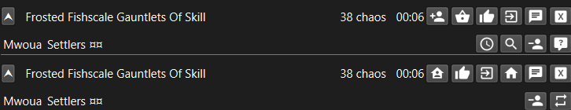

# TradeHelperForPoe

## Overview

This is a remake of [TraderForPoe](https://github.com/hexadezi/TraderForPoe)

Small overlay to easily manager trade. It checks incoming and outgoing whispers for trade request and display a small widget with buttons.

## Install

Extract the zip file and run. You may need [visual studio redistributables](https://aka.ms/vs/17/release/vc_redist.x64.exe)
