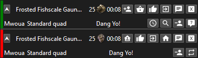

# TradeHelperForPoe

## Overview

This is a remake of [TraderForPoe](https://github.com/hexadezi/TraderForPoe), but for both Path Of Exile 1 and 2

Small overlay to easily manage trade. It checks incoming and outgoing whispers for trade request and display a small widget with buttons to invite, start the trade, go to hideout, etc...

Incoming and outgoing trade:  

## Install

Extract the zip file and run. You may need [visual studio redistributables](https://aka.ms/vs/17/release/vc_redist.x64.exe)

## Initial configuration

The game needs to be in windowed or windowed fullscreen

- Locate the icon in the status bar, right click on it, go to settings
- Enter the full path to your Client.txt
- Resize and position the widget circled in red. It will be its position when you actually receive a trade
- Optional: configure your "Thanks", "Busy", "Custom message"
